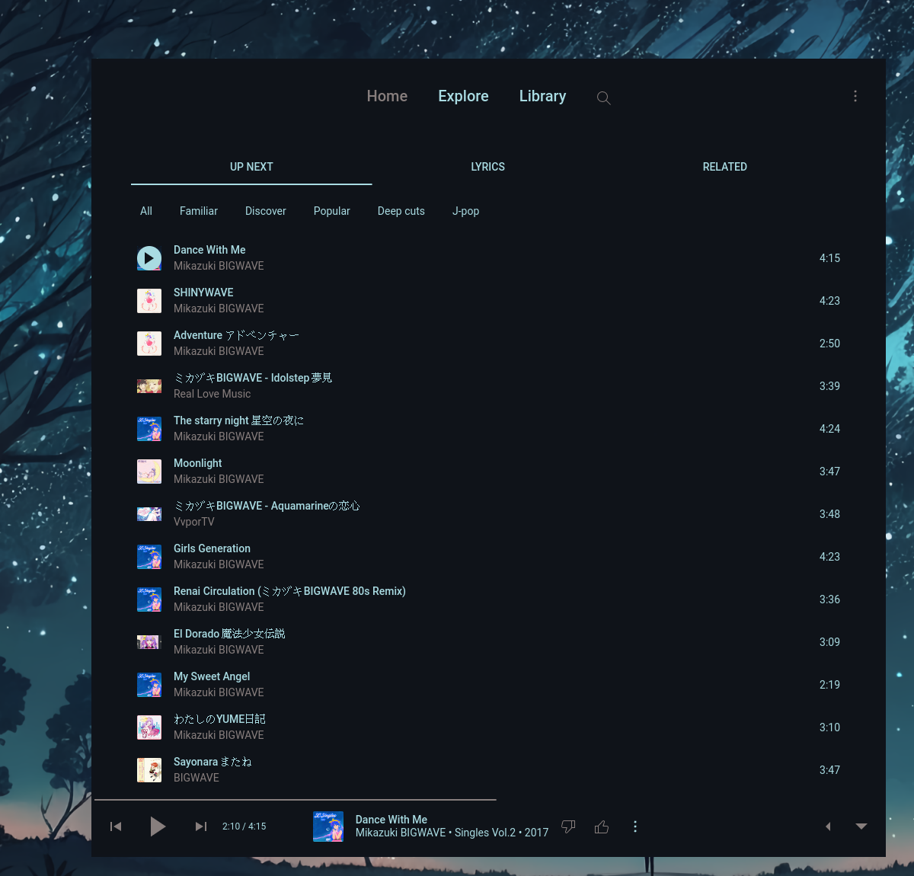

<h2 align="center">Dynamic theming of Youtube-Music using your Pywal colors</h2>



## Installation
```bash
git clone https://github.com/bluzukk/Youwal.git
cd Youwal
chmod +x youwal
```
## TODO
Needs to be update to fully support the newly added playlist style. Feel free to send a PR 

## Usage
* Generate your colors using `pywal`
* Run `youwal` 
* Inject `~/.config/youwal/youwal.css`

### Note if using [th-ch/youtube-music](https://github.com/th-ch/youtube-music)
* The css needs to be injected only once! For a new theme just run `pywal` and `youwal` then restart `youtube-music`
